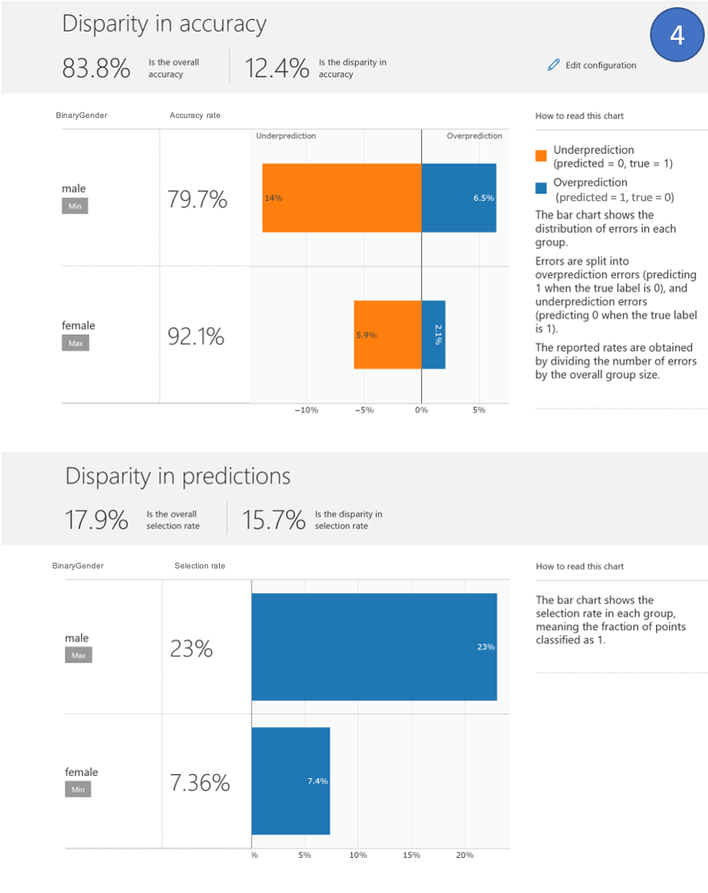
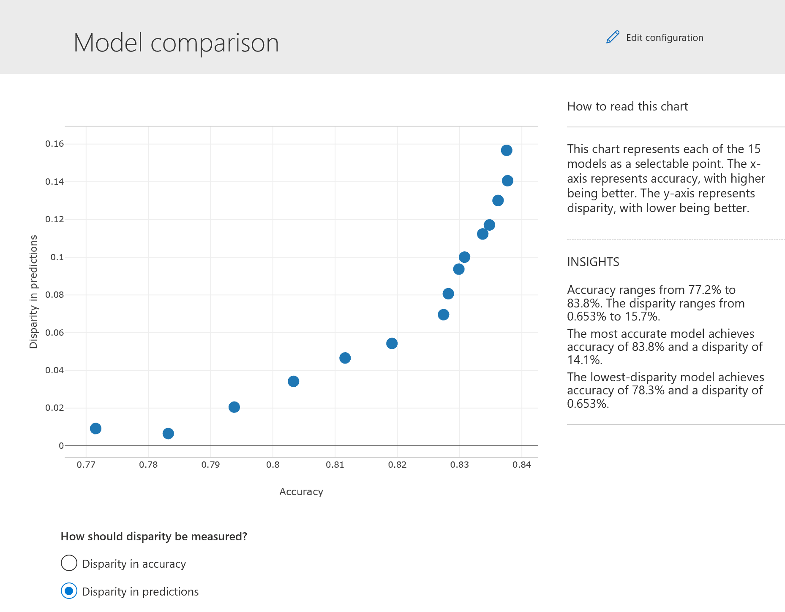

[](https://dev.azure.com/responsibleai/fairlearn/_build/latest?definitionId=23&branchName=master)   [](https://gitter.im/fairlearn/community?utm_source=badge&utm_medium=badge&utm_campaign=pr-badge)

# Fairlearn

Fairlearn is a Python package that empowers developers of artificial intelligence (AI) systems to assess their system's fairness and mitigate any observed unfairness issues. Fairlearn contains mitigation algorithms as well as a Jupyter widget for model assessment. Besides the source code, this repository also contains Jupyter notebooks with examples of Fairlearn usage.

- [Current release](#current-release)
- [What we mean by _fairness_](#what-we-mean-by-fairness)
- [Overview of Fairlearn](#overview-of-fairlearn)
  - [Fairlearn algorithms](#fairlearn-algorithms)
  - [Fairlearn dashboard](#fairlearn-dashboard)
- [Install Fairlearn](#install-fairlearn)
- [Usage](#usage)
- [Contributing](#contributing)
- [Maintainers](#maintainers)
- [Issues](#issues)

## Current release

- The current stable release is available at [Fairlearn v0.4.4](https://github.com/fairlearn/fairlearn/tree/v0.4.4).

- Our current version differs substantially from version 0.2 or earlier. Users of these older versions should visit our [onboarding guide](#onboarding-guide).

## What we mean by _fairness_

An AI system can behave unfairly for a variety of reasons. In Fairlearn, we define whether an AI system is behaving unfairly in terms of its impact on people &ndash; i.e., in terms of harms. We focus on two kinds of harms:

- _Allocation harms._ These harms can occur when AI systems extend or withhold opportunities, resources, or information. Some of the key applications are in hiring, school admissions, and lending.

- _Quality-of-service harms._ Quality of service refers to whether a system works as well for one person as it does for another, even if no opportunities, resources, or information are extended or withheld.

We follow the approach known as **group fairness**, which asks: _Which groups of individuals are at risk for experiencing harms?_ The relevant groups need to be specified by the data scientist and are application specific.

Group fairness is formalized by a set of constraints, which require that some aspect (or aspects) of the AI system's behavior be comparable across the groups. The Fairlearn package enables assessment and mitigation of unfairness under several common definitions.
To learn more about our definitions of fairness, please visit our [terminology page](./TERMINOLOGY.md#fairness-of-ai-systems).

>_Note_:
> Fairness is fundamentally a sociotechnical challenge. Many aspects of fairness, such as justice and due process, are not captured by quantitative fairness metrics. Furthermore, there are many quantitative fairness metrics which cannot all be satisfied simultaneously. Our goal is to enable humans to assess different mitigation strategies and then make trade-offs appropriate to their scenario.

## Overview of Fairlearn

The Fairlearn package has two components:

- A _dashboard_ for assessing which groups are negatively impacted by a model, and for comparing multiple models in terms of various fairness and accuracy metrics.

- _Algorithms_ for mitigating unfairness in a variety of AI tasks and along a variety of fairness definitions.

### Fairlearn algorithms

Fairlearn contains the following algorithms for mitigating unfairness in binary classification and regression:

| algorithm | description | classification/regression | sensitive features | supported fairness definitions |
| --- | --- | --- | --- | --- |
| `fairlearn.` `reductions.` `ExponentiatedGradient` | Black-box approach to fair classification described in [A Reductions Approach to Fair Classification](https://arxiv.org/abs/1803.02453)| binary classification | categorical | DP, EO |
| `fairlearn.` `reductions.` `GridSearch` | Black-box approach described in Section 3.4 of [A Reductions Approach to Fair Classification](https://arxiv.org/abs/1803.02453)| binary classification | binary | DP, EO |
| `fairlearn.` `reductions.` `GridSearch` | Black-box approach that implements a grid-search variant of the algorithm described in Section 5 of [Fair Regression: Quantitative Definitions and Reduction-based Algorithms](https://arxiv.org/abs/1905.12843) | regression | binary | BGL |
| `fairlearn.` `postprocessing.` `ThresholdOptimizer` | Postprocessing algorithm based on the paper [Equality of Opportunity in Supervised Learning](https://arxiv.org/abs/1610.02413). This technique takes as input an existing classifier and the sensitive feature, and derives a monotone transformation of the classifier's prediction to enforce the specified parity constraints. | binary classification | categorical | DP, EO |

> _Note_:
> DP refers to demographic parity, EO to equalized odds, and BGL to bounded group loss. For more information on these and other terms we use in this repository please refer to the [terminology page](./TERMINOLOGY.md). To request additional algorithms or fairness definitions, please open a [new issue](https://github.com/fairlearn/fairlearn/issues).


### Fairlearn dashboard

Fairlearn dashboard is a Jupyter notebook widget for assessing how a model's predictions impact different groups (e.g., different ethnicities), and also for comparing multiple models along different fairness and accuracy metrics.  

#### Set-up and a single-model assessment

To assess a single model's fairness and accuracy, the dashboard widget can be launched within a Jupyter notebook as follows:

```python
from fairlearn.widget import FairlearnDashboard

# A_test containts your sensitive features (e.g., age, binary gender)
# sensitive_feature_names containts your sensitive feature names
# y_true contains ground truth labels
# y_pred contains prediction labels

FairlearnDashboard(sensitive_features=A_test,
                   sensitive_feature_names=['BinaryGender', 'Age'],
                   y_true=Y_test.tolist(),
                   y_pred=[y_pred.tolist()])
```


After the launch, the widget walks the user through the assessment set-up, where the user is asked to select (1) the sensitive feature of interest (e.g., binary gender or age), and (2) the accuracy metric (e.g., model precision) along which to evaluate the overall model performance as well as any disparities across groups. These selections are then used to obtain the visualization of the model's impact on the subgroups (e.g., model precision for females and model precision for males).

The following figures illustrate the set-up steps, where _binary gender_ is selected as a sensitive feature and _accuracy rate_ is selected as the accuracy metric.


After the set-up, the dashboard presents the model assessment in two panels:


|Panel|Description|
|-----|-----------|
| Disparity in accuracy | This panel shows: (1) the accuracy of your model with respect to your selected accuracy metric (e.g., _accuracy rate_) overall as well as on different subgroups based on your selected sensitive feature (e.g., _accuracy rate_ for females, _accuracy rate_ for males); (2) the disparity (difference) in the values  of the selected accuracy metric across different subgroups; (3) the distribution of errors in each subgroup (e.g., female, male). For binary classification, the errors are further split into overprediction (predicting 1 when the true label is 0), and underprediction (predicting 0 when the true label is 1). |
| Disparity in predictions | This panel shows a bar chart that contains the selection rate in each group, meaning the fraction of data classified as 1 (in binary classification) or distribution of prediction values (in regression). |




#### Comparing multiple models

The dashboard also enables comparison of multiple models, such as the models produced by different learning algorithms and different mitigation approaches, including `fairlearn.reductions.GridSearch`, `fairlearn.reductions.ExponentiatedGradient` and `fairlearn.postprocessing.ThresholdOptimizer`.

As before, the user is first asked to select the sensitive feature and the accuracy metric. The _model comparison_ view then depicts the accuracy and disparity of all the provided models in a scatter plot. This allows the user to examine trade-offs between accuracy and fairness. Each of the dots can be clicked to open the assessment of the corresponding model. The figure below shows the model comparison view with `binary gender` selected as a sensitive feature and `accuracy rate` selected as the accuracy metric.





## Install Fairlearn

The package can be installed via

```python
pip install fairlearn
```

or optionally with a full feature set by adding extras, e.g.
`pip install fairlearn[customplots]`.

or you can clone the repository locally via

```python
git clone git@github.com:fairlearn/fairlearn.git
```

To verify that the cloned repository works (the pip package does not include
the tests), run

```python
pip install -r requirements.txt
python -m pytest -s ./test/unit
```


<details name="onboarding-guide">
<summary>
<strong>
<em>
Onboarding guide for users of version 0.2 or earlier
</em>
</strong>
</summary>

Up to version 0.2, fairlearn contained only the exponentiated gradient method.
The Fairlearn repository now has a more comprehensive scope and aims to
incorporate other methods as specified above. The same exponentiated gradient
technique is now the class `fairlearn.reductions.ExponentiatedGradient`. While
in the past exponentiated gradient was invoked via

```python
import numpy as np
from fairlearn.classred import expgrad
from fairlearn.moments import DP

estimator = LogisticRegression()  # or any other estimator
exponentiated_gradient_result = expgrad(X, sensitive_features, y, estimator, constraints=DP())
positive_probabilities = exponentiated_gradient_result.best_classifier(X)
randomized_predictions = (positive_probabilities >= np.random.rand(len(positive_probabilities))) * 1
```

the equivalent operation is now

```python
from fairlearn.reductions import ExponentiatedGradient, DemographicParity

estimator = LogisticRegression()  # or any other estimator
exponentiated_gradient = ExponentiatedGradient(estimator, constraints=DemographicParity())
exponentiated_gradient.fit(X, y, sensitive_features=sensitive_features)
randomized_predictions = exponentiated_gradient.predict(X)
```

Please open a [new issue](https://github.com/fairlearn/fairlearn/issues) if you
encounter any problems.

</details>

## Usage

For common usage refer to the [Jupyter notebooks](./notebooks) and our [API
guide](./CONTRIBUTING.md#api)

## Contributing

To contribute please check our [contributing guide](./CONTRIBUTING.md).

## Maintainers

The Fairlearn project is maintained by:

- **@MiroDudik**
- **@riedgar-ms**
- **@rihorn2**
- **@romanlutz**

For a full list of contributors refer to the [authors page](./AUTHORS.md)

## Issues

### Usage Questions

Pose questions and help answer them on [Stack
Overflow](https://stackoverflow.com/questions/tagged/fairlearn) with the tag
`fairlearn` or on [Gitter](https://gitter.im/fairlearn/community#).

### Regular (non-security) issues

Issues are meant for bugs & feature requests. Please submit a report through
[GitHub issues](https://github.com/fairlearn/fairlearn/issues). A maintainer
will respond promptly as follows:
- **bug**: triage as `bug` and provide estimated timeline based on severity
- **feature request**: triage as `feature request` and provide estimated
  timeline
- **question** or **discussion**: triage as `question` and either respond or
  notify/identify a suitable expert to respond

Maintainers will try to link duplicate issues when possible.

### Reporting security issues

Please take a look at our guidelines for reporting [security issues](./SECURITY.md).
